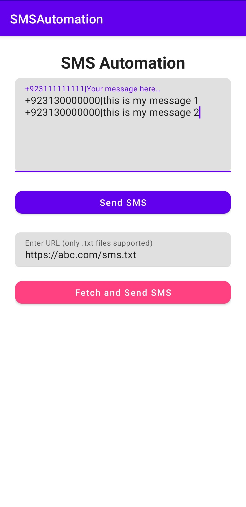

# SMS Automation App

This Android application allows users to automate the process of sending SMS messages to multiple recipients. The app allows the user to input multiple phone numbers and messages, and it can send these messages using the built-in SMS functionality of the device. Additionally, it supports fetching SMS data from a server and sending messages accordingly.

## Features

- **Bulk SMS Sending**: Users can enter phone numbers and corresponding messages, which will be sent automatically to each recipient.
- **Fetch SMS Data**: The app allows users to input a URL and fetch SMS data (phone numbers and messages) from the server to send them in bulk.
- **Permissions**: The app requests the necessary permissions to send SMS, receive boot completion, and access the internet.

## Technologies Used

- **Java**: The app is built using Java and Android SDK.
- **OkHttp**: For making network requests to fetch SMS data from the server.
- **SMS Manager**: To send SMS messages from the device.
- **Material Design**: UI components such as `TextInputLayout`, `MaterialButton`, and `TextInputEditText` for modern and consistent user interfaces.

## Setup and Installation

1. **Clone the Repository**:
   ```bash
   git clone https://github.com/iamkahmadi/sms-automation.git
   cd sms-automation
    ```

2. **Open the Project**:
   Open the project in **Android Studio** or any IDE that supports Android development.

3. **Install Dependencies**:
   The project uses OkHttp for network requests. Ensure that your project has the following dependencies in `build.gradle`:

   ```gradle
   dependencies {
       implementation 'com.squareup.okhttp3:okhttp:4.9.0'
       implementation 'com.google.android.material:material:1.3.0'
   }
   ```

4. **Run the App**:
   After opening the project, you can run it on an emulator or a physical Android device.

## Permissions

The app requires the following permissions to function:

* **SEND\_SMS**: To send SMS messages.
* **RECEIVE\_BOOT\_COMPLETED**: To allow the app to start on boot if necessary.
* **INTERNET**: To fetch SMS data from a server via HTTP requests.

These permissions are declared in the `AndroidManifest.xml` file:

```xml
<uses-permission android:name="android.permission.SEND_SMS"/>
<uses-permission android:name="android.permission.RECEIVE_BOOT_COMPLETED"/>
<uses-permission android:name="android.permission.INTERNET"/>
```

## MainActivity Overview

### Bulk SMS Sending

The `MainActivity` provides an interface where the user can input phone numbers and messages in a specific format (`<phone number>|<message>`). The app then processes this input and sends SMS messages to each recipient.

### Fetch SMS Data from Server

The app also allows users to input a URL that returns SMS data (phone numbers and messages). The app then parses the data and sends messages accordingly. This is implemented using the OkHttp library to make network requests.


## Screenshots

Include screenshots of your app in action here. For example:



